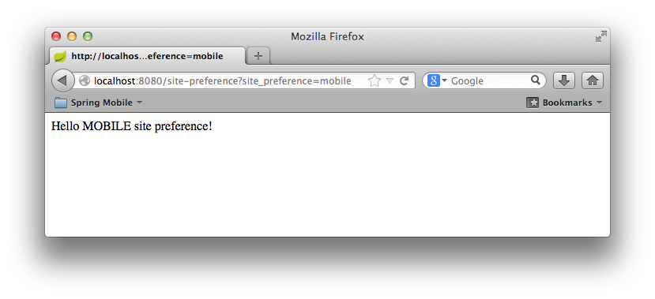
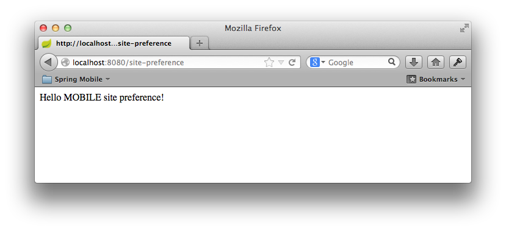

:spring_boot_version: 1.2.4.RELEASE
:SitePreferenceHandlerInterceptor: http://docs.spring.io/spring-mobile/docs/1.1.x/api/org/springframework/mobile/device/site/SitePreferenceHandlerInterceptor.html
:DeviceResolverHandlerInterceptor: http://docs.spring.io/spring-mobile/docs/1.1.x/api/org/springframework/mobile/device/DeviceResolverHandlerInterceptor.html
:SpringApplication: http://docs.spring.io/spring-boot/docs/{spring_boot_version}/api/org/springframework/boot/SpringApplication.html
:DispatcherServlet: http://docs.spring.io/spring/docs/current/javadoc-api/org/springframework/web/servlet/DispatcherServlet.html
:HandlerInterceptor: http://docs.spring.io/spring/docs/3.2.x/javadoc-api/org/springframework/web/servlet/HandlerInterceptor.html
:Device: http://docs.spring.io/spring-mobile/docs/1.1.x/api/org/springframework/mobile/device/Device.html
:WebMvcConfigurerAdapter: http://docs.spring.io/spring/docs/3.2.x/javadoc-api/org/springframework/web/servlet/config/annotation/WebMvcConfigurerAdapter.html
:ResponseBody: http://docs.spring.io/spring/docs/3.2.x/javadoc-api/org/springframework/web/bind/annotation/ResponseBody.html
:SitePreferenceMethodArgumentResolver: http://docs.spring.io/spring-mobile/docs/1.1.x/api/org/springframework/mobile/device/site/SitePreferenceHandlerMethodArgumentResolver.html
:toc:
:icons: font
:source-highlighter: prettify
:project_id: gs-handling-site-preference

This guide walks you through the process of using Spring to provide a user with the choice of viewing a normal, mobile, or tablet version of your site, regardless of what type of device being used.

== What you'll build

You will create a Spring Web MVC application that detects the type of device that is accessing your web site and enables functionality to override the default view for the device by selecting an alternate site preference.

== What you'll need

:java_version: 1.7
include::https://raw.githubusercontent.com/spring-guides/getting-started-macros/master/prereq_editor_jdk_buildtools.adoc[]

:jump_ahead: Create a configuration class
include::https://raw.githubusercontent.com/spring-guides/getting-started-macros/master/how_to_complete_this_guide.adoc[]

include::https://raw.githubusercontent.com/spring-guides/getting-started-macros/master/hide-show-gradle.adoc[]

include::https://raw.githubusercontent.com/spring-guides/getting-started-macros/master/hide-show-maven.adoc[]

include::https://raw.githubusercontent.com/spring-guides/getting-started-macros/master/hide-show-sts.adoc[]

[[initial]]
== Auto-configuration

Spring Boot auto-configures three classes, {DeviceResolverHandlerInterceptor}[`DeviceResolverHandlerInterceptor`], {SitePreferenceHandlerInterceptor}[`SitePreferenceHandlerInterceptor`] and {SitePreferenceMethodArgumentResolver}[`SitePreferenceMethodArgumentResolver`]. {DeviceResolverHandlerInterceptor}[`DeviceResolverHandlerInterceptor`] is an implementation of a {HandlerInterceptor}[`HandlerInterceptor`] which, as the name implies, intercepts a request to the application and determines the type of requesting device. After the device is resolved, the {SitePreferenceMethodArgumentResolver}[`SitePreferenceMethodArgumentResolver`] allows Spring MVC to use the resolved `SitePreference` object in a controller method.

Internally, {DeviceResolverHandlerInterceptor}[`DeviceResolverHandlerInterceptor`] examines the `User-Agent` header in the incoming request, and based on the header value, determines whether the request is coming from a normal (desktop) browser, a mobile (phone) browser, or a tablet browser. {DeviceResolverHandlerInterceptor}[`DeviceResolverHandlerInterceptor`] offers several entry points for overriding or customizing how a device is resolved.

{SitePreferenceHandlerInterceptor}[`SitePreferenceHandlerInterceptor`] utilizes the detected device to determine a user's initial site preference. If the user prefers a different site, then that site preference and be used in subsequent requests to override the resolved device value. The site preference is set by passing a specific query string parameter in a request. Once received, the preference is persisted in a cookie for future reference.

Site preference functionality is enabled by default in Spring Boot when you include the Spring Mobile starter. However, it can be disabled by setting the following property to `false`:

`src/main/resources/application.properties`
[source,java]
----
include::complete/src/main/resources/application.properties[]
----

== Create a web controller

In Spring, web endpoints are simply Spring MVC controllers. The following Spring MVC controller handles a GET request and returns a String indicating the type of the device:

`src/main/java/hello/GreetingController.java`
[source,java]
----
include::complete/src/main/java/hello/GreetingController.java[]
----

For this example, rather than rely on a view (such as JSP) to render model data in HTML, this controller simply returns the data to be written directly to the body of the response. In this case, the data is a String that reads "Hello NORMAL site preference!" if the requesting client is a desktop browser. The {ResponseBody}[`@ResponseBody`] annotation tells Spring MVC to write the returned object into the response body, rather than to render a model into a view.

== Make the application executable

Although it is possible to package this service as a traditional link:/understanding/WAR[WAR] file for deployment to an external application server, the simpler approach demonstrated in the next section creates a _standalone application_. You package everything in a single, executable JAR file, driven by a good old Java `main()` method. And along the way, you use Spring's support for embedding the link:/understanding/Tomcat[Tomcat] servlet container as the HTTP runtime, instead of deploying to an external instance.

`src/main/java/hello/Application.java`
[source,java]
----
include::complete/src/main/java/hello/Application.java[]
----

`@SpringBootApplication` is a convenience annotation that adds all of the following:
    
- `@Configuration` tags the class as a source of bean definitions for the application context.
- `@EnableAutoConfiguration` tells Spring Boot to start adding beans based on classpath settings, other beans, and various property settings.
- Normally you would add `@EnableWebMvc` for a Spring MVC app, but Spring Boot adds it automatically when it sees **spring-webmvc** on the classpath. This flags the application as a web application and activates key behaviors such as setting up a `DispatcherServlet`.
- `@ComponentScan` tells Spring to look for other components, configurations, and services in the the `hello` package, allowing it to find the `HelloController`.

The `main()` method uses Spring Boot's `SpringApplication.run()` method to launch an application. Did you notice that there wasn't a single line of XML? No **web.xml** file either. This web application is 100% pure Java and you didn't have to deal with configuring any plumbing or infrastructure.

include::https://raw.githubusercontent.com/spring-guides/getting-started-macros/master/build_an_executable_jar_subhead.adoc[]

include::https://raw.githubusercontent.com/spring-guides/getting-started-macros/master/build_an_executable_jar_with_both.adoc[]

Logging output is displayed. The service should be up and running within a few seconds.

== Test the service

To test the application, open the following link in a browser. In a normal desktop browser, you should see something like this:

http://localhost:8080/site-preference

image::images/initial-request.png[The initial response for a normal desktop browser]

By passing the `site_preference=mobile` querystring parameter, a user can specify a preference for the mobile site. For example, your site may expose a link from the home page. The link below includes the parameter to change your site preference.

http://localhost:8080/site-preference?site_preference=mobile

The site preference is now stored in a cookie and subsequent requests to the site will respect the new preference, without the need of a querystring parameter.

http://localhost:8080/site-preference

== Summary

Congratulations! You have just developed a simple web page that detects the type of device being used by a client and offers the option to prefer a different version of the site.

